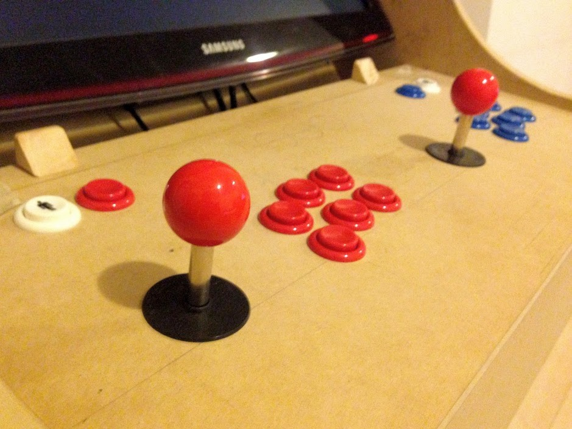

I spent the last year building a real-size arcade cabinet. I found myself installing and reinstalling RetroPie on Raspberry Pi several times. So, everytime I screwed up and reinstalled, I had to reconfigure the entire system by following the exact same steps to get where I was. The erasing and reinstalling processes were caused for a notable lack of information about many setup choices you have to do. I didn't found many recommendations.

## What is RetroPie

If you came here with not knowing what RetroPie is, take a look at this awesome project: https://retropie.org.uk/

> RetroPie allows you to turn your Raspberry Pi, ODroid C1/C2, or PC into a retro-gaming machine.

## About this guide

I started this guide for myself, to follow the steps in the exact order that it was written. Originally this guide has only contained my specific use case, but because was difficult to me to find some answers, I want to give some back to the RetroPie community by sharing my findings.

This guide is intended to give some recommendations and solutions for cases that I had to find and try by myself. It's a complement to the original [RetroPie documentation](https://github.com/RetroPie/RetroPie-Setup/wiki). Feel free to comment if any information is not accurate, or there is a better way to do the same.

It's important to read carefully every step, to avoid any trouble during the setup. Not all of the steps are mandatory, and you can jump the optional steps, but I recommend to always respect the given order.

## Installing RetroPie

The first thing to do is to install the RetroPie in the Raspberry Pi. It's gonna be a little different depending on the model of your Raspberry Pi.

- **Step 1.** Identify which model of the Raspberry Pi you have, following [this guide](https://www.element14.com/community/community/raspberry-pi/blog/2016/11/21/how-to-identify-which-model-of-the-raspberry-pi-you-have). You only need to know if you own a **Raspberry Pi 1, 2, 3 or Zero**.

- **Step 2.** Download the [RetroPie SD image](https://retropie.org.uk/download/) corresponding to your Raspberry Pi model. I recommend to keep the file of the RetroPie pre-made image (don't delete it after use it), so is easier to start over.

- **Step 3.** Connect the SD card to a computer. It's not necessary to have an SD card with a lot of space, because you need to install only RetroPie in there. I recommend to keep the ROMs and saved games progress external as you can see [below](#setting-usb-storage).

- **Step 4.** Burn the RetroPie image into the SD card, using:
  - [Win32DiskImager](http://sourceforge.net/projects/win32diskimager/) on Windows.
  - [Apple Pi Baker](http://www.tweaking4all.com/hardware/raspberry-pi/macosx-apple-pi-baker/) on Mac OS X.
  - [Etcher](https://etcher.io/) on Linux.

- **Step 5.** Do not plug the SD into the Raspberry Pi yet. Keep the SD card plugged into your computer. You'll notice the SD card is now called `boot`.

## Configure before turn it on

Most of the missing information is about how to setup the hardware to work as you need. So these are the most important things I recommend you to check out.

### Setting up the USB Storage

I recommend to keep the game ROMs and the saved games progress in an external source. This way makes easier to experiment with RetroPie in the SD card, and keep the important data safe in a plug-n-play source.

- **Step 6.** Format a USB drive as `FAT`. Use any disk utility available on your OS.
- **Step 7.** Create a folder named `retropie-mount` on the root of the USB drive. This is going to be used by RetroPie every time you boot the system.

Find more info about this in the official RetroPie documentation: [Running ROMs from a USB drive](https://github.com/RetroPie/RetroPie-Setup/wiki/Running-ROMs-from-a-USB-drive).

### Overclocking the Raspberry Pi

If you have a Raspberry Pi Model 1, I recommend to overclock your board. That way you can run more complex games as in a Raspberry Pi Model 2. For example a Raspberry Pi Model 1 doesn't have the power enough to run most of the Neo Geo or MS-DOS games, but an overclocked one actually does.

There are 2 ways to overclock a Raspberry Pi: the wrong one and the right one. The wrong way lets you expand the core and memory boundaries as you want, but it's dangerous to your board and also [voids the warranty](https://www.raspberrypi.org/documentation/configuration/config-txt/overclocking.md). The right way is provided by Raspberry Pi itself so take a look at this post: [Introducing Turbo Mode: up to 50% more performance for free](https://www.raspberrypi.org/blog/introducing-turbo-mode-up-to-50-more-performance-for-free/).

Let's do this in the right way:

- **Step 8.** Edit file `/config.txt` and add (or uncomment if it's already there):
  ```
  force_turbo=1
  ```

### Setting arcade controller

This was the hardest thing to find. The docs are in [plain sight](https://github.com/RetroPie/RetroPie-Setup/wiki/Xin-Mo-Controller), but you need to know the name of you're looking for to find it. So, I spent a lot of time looking how to configure THIS kind of controller:



The magic words are **Xin Mo**. It's that simple. Now, to configure RetroPie to recognize this kind of controller...

- **Step 9.** Edit `/cmdline.txt` and write at the end of the file:
  ```
  usbhid.quirks=0x16c0:0x05e1:0x040
  ```

There are a few more steps to configure the controller, but wait till [turning on the system](#now-turn-it-on).

Find more information about the Xin Mo Controller in the [official RetroPie documentation](https://github.com/retropie/retropie-setup/wiki/Xin-Mo-Controller).

### Forcing HDMI sound

If you're using a computer monitor, it probably doesn't have built-in speakers. And in most of cases, this kind of monitor has a 3.5mm jack to output sound to external speakers. In that case, you may have to make that the HDMI takes control over the sound:

- **Step 10.** Force the HDMI by adding the following line to `/config.txt`:
  ```
  hdmi_drive=2
  ```

Some articles from different guides says you can also increase the sound quality.

- **Step 11.** Update the `/retroarch.cfg` file with:
  ```
  audio_out_rate = 44100
  ```

Using that configuration, the sound coming from the headphone jack is a lot clearer and has a lot less static.

## Now turn it on

You're set. Plug the SD card and the USB drive into the Raspberry Pi and turn on. As is the first time to run RetroPie, it's gonna take a little more time to process everything.

The first screen to appear is like "Welcome, I found some controller plugged in":


### Setting up controller

You've to configure each button of the controller. I recommend to use the same distribution that the Sega Genesis controller:


- **Step 12.** My choice of configuration for [Xin Mo controller](#setting-arcade-controller) is:
  - For arrows, only set "up", "down", "left" and "right" on "D-PAD".
  - For buttons, use the same distribution that the Sega Genesis controller. You can change this later and even [configure controller for individual systems and individual games](https://github.com/RetroPie/RetroPie-Setup/wiki/retroarch-configuration).
  - For anything else, keep pressing any key some seconds to set "-NOT DEFINED-".

  **From now on, the "A" button is *ACCEPT* and "B" button is *CANCEL*.**

To configure the controller number two:

- **Step 13.** Press "Start" to open the menu, then "Configure input". This time keep pressing any button of the controller two:

## Games, games, games!

That was all related to the initial setup. Now it's all about games.

- **Step 14.** Unplug the USB drive and plug into your computer.

Now the folder `/retropie-mount` should have some folders inside:


### ROMs

All the game ROMs must go inside `/retropie-mount/roms`.

- **Step 15.** Place ROMs corresponding to its console folder. Avoid zip files, because aren't supported.

- **Step 16.** Plug USB drive to the Raspberry Pi and wait until the USB drive LED stop blinking.

- **Step 17.** Reset EmulationStation: Press Start (menu) -> Quit -> Restart EmulationStation.

The ROMs are added instantly to EmulationStation. You're gonna see them in the main menu of RetroPie under the console name. Now enjoy! Repeat steps 14-17 to add ROMs as much as the USB drive size allows you.

## Specific setups

Following the steps above, you'll have access to the most common consoles and games. But by following a few more steps you can go beyond.

### Sega Megadrive/Genesis

By default, the Sega emulator is configured to recognize only 3 buttons (Megadrive joystick). In my case, I had installed 6 buttons in my arcade cabinet, so I had to activate all of them (like a Genesis joystick).

To do so:

1. Launch a Megadrive/Genesis game and go to the RetroArch menu ("Select" + "X").
2. Go to "Quick Menu" -> "Options" and set the two input devices to 6 button pad.
3. Exit the RetroArch menu.

### Neo Geo

This emulator works a little different from other ones. Before copying ROMs, you need to:

1. Get the Neo Geo BIOS. You'll need a `neogeo.zip` file.
2. Copy the zip file (compressed) to `/retropie-mount/BIOS` and `/retropie-mount/roms/neogeo`.
3. Move ROMs as zip (compressed) to `/retropie-mount/roms/neogeo`.
4. Restart EmulationStation.

Most of the games won't work. But there is hope. When a game doesn't work you can change the emulator for that specific game:

1. Open a game and press any key before it loads.
2. Go to "Select emulator for rom" -> "lr-fba" (or any other emulator) -> "Exit without launching".
3. Relaunch game manually.
4. If game still doesn't work, move on to another game.

For more info visit this complete video tutorial: [How to Set Up And Use NEOGEO Emulator Retropie Raspberry pi 1 2 3 and Zero](https://www.youtube.com/watch?v=5Qn11F2ekFY).

### MS-DOS

Beyond this point, you'll need to plug a keyboard.

1. Connect the Raspberry Pi to the Internet.
2. Check the board is online by looking into "Show IP" menu.
3. Go to the RetroPie settings: "RetroPie" -> "Retropie setup". The first time to get in there, can take several minutes.
4. Install DosBox: "Manage packages" -> "manage optional packages" -> "dosbox" -> "install from binary". It's gonna take some time, because it needs to download packages from Internet.
5. When it ends, go back to the main menu, then restart the system: "Perform reboot".

Now MS-DOS is a console in the list of consoles. Also a new folder `/retropie-mount/roms/pc` will be created automatically on the USB drive.

For more info visit this complete video tutorial: [Simple DOSBox Setup RetroPie MS-DOS Raspberry Pi](https://www.youtube.com/watch?v=-dcubuDfdxY).

### MAME

I had the worst experience trying to understand this platform. I recommend to play arcade games on Neo Geo or find a version of the games for a more common console. In case you choose to use arcade games anyway, follow these steps.

There are different versions of MAME, that was launched in different years. So, for example, if you have the emulator for MAME `0.37b5`, you must get games with the specific version `0.37b5`. For some versions, the games are far more difficult to get than others. But there is another factor that forces to choose one version among other: the Raspberry Pi model.

- For Raspberry Pi Zero and 1, ROMs has to be version `0.37b5` (mame2000).
- For Raspberry Pi 2 and 3, ROMs has to be version `0.78` (mame2003).

Then to copy ROMs:

- Copy zip ROMs to the folder `/ROMs/arcade`.
- Do not use folders specific for emulators, like `/mame-xxxx`.
- Upload compressed (.zip) ROMs. Folders won't work.

The first time a game is running, it will ask for an emulator to run:

- For Raspberry Pi Zero and Pi 1, choose `mame4all` (mame2000).
- For Raspberry Pi 2 and Pi 3, choose `lr-mame2003` (mame2003).

---

That's all far I could go. I'll update this guide as I find more and better solutions. Now I’m working on make that MS-DOS games run with the [Xin Mo controller](#setting-arcade-controller) 👌.
