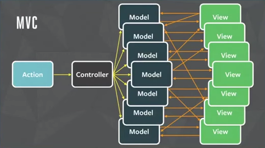

Les dejo el video *"Rethinking Web App Development at Facebook"*:

http://youtu.be/nYkdrAPrdcw

Está bueno para ver las preguntas que se hacen, y las respuestas que encuentran.

# Mis notas

Un objetivo que Facebook persigue es **generar software de calidad**.

Según ellos, se entiende por calidad a:

- **Código seguro.**
- **Código performante.**
- **UI "disfrutable".**
- **Interfaz facil de usar (UX).**

La calidad lleva tiempo. Cuanta más calidad se busca, más tiempo lleva desarrollarlo.

Lo que más se valora en Facebook es la habilidad de moverse rápido. Necesitan salir a producción cuanto antes para recolectar métricas, feedback, etc. Así, pueden iterar lo mas rápido posible y tener el mejor producto.

En el video comentan que esas 2 cosas no conviven (calidad vs. velocidad).

# Cómo lograr mejor calidad en menos tiempo

Intentaron varias maneras. A nivel equipo:

- Recortar features: *"pero si estás queriendo agregar valor a tu producto, eliminar funcionalidades para tener lo mínimo indispensable no está bueno."*
- Agregar gente: *"pero no podés agregar developers a un problema esperando que lo resuelvan mas rápido y con buena calidad."*
- Pedirle a la gente que trabaje mas duro: *"pero no es sustentable pedir que trabajen 15 horas por día."*

A nivel stack tecnológico intentaron:

- Usar MVC: pero no escala porque se empieza a complicar muy rápido. **Cada vez que agregan nuevos features, el sistema entero cambia.** Esto genera que el código sea impredecible. Es decir que, entra gente nueva a ver el código y les toma tiempo para entender si lo que se va a modificar impacta en el resto de la aplicación.

Para aumentar la calidad y reducir el tiempo, probaron hacer que el código sea predecible:

- Usar Flux Pattern: *arquitectura que genera un flujo de datos unidireccional (a diferencia del MVC)*

# MVC pattern

*"Buenísimo para aplicaciones chicas."*

Difícil entender qué vista se relaciona con qué modelo.

# Flux pattern

Flujo de datos de una sola dirección. Las "flechas" van en un solo sentido.

Ponen como ejemplo el chat de Facebook. El chat se comunica con la barra de notificaciones.

A medida que fueron agregando features, el código se les hizo largo.

Y en lugar de darle el control a un agente externo (handler), se le da el control a cada integrante:

A partir de acá, el video trata de React. Es un framework de Facebook que implementa Flux.

# React

Recarga todo el componente entero cuando cambia una parte.

Para que no sea pesado usa un DOM virtual. Hacen cambios individuales ahí y después pisan todo el componente una sola vez en el DOM real.

Todo Instagram esta hecho con React.
