Some time ago, I won a starter kit from [Make Magazine](https://makezine.com/) with a Raspberry Pi Model 1.

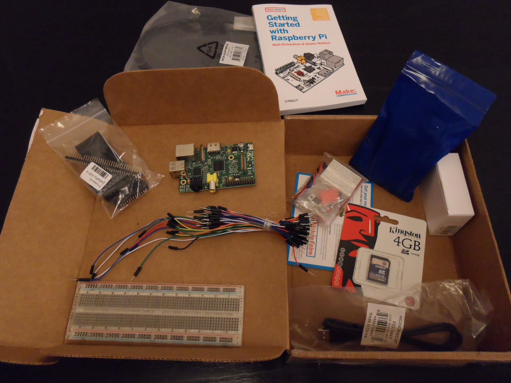

Since then, I started looking for something interesting to build and I found the [RetroPie Project](https://retropie.org.uk/).

## RetroPie

This project allows you to turn your Raspberry Pi into a retro-gaming machine. So I made a quick test with some ROMs to check how it worked. It was really easy to have a working retro console with nearly zero configuration.

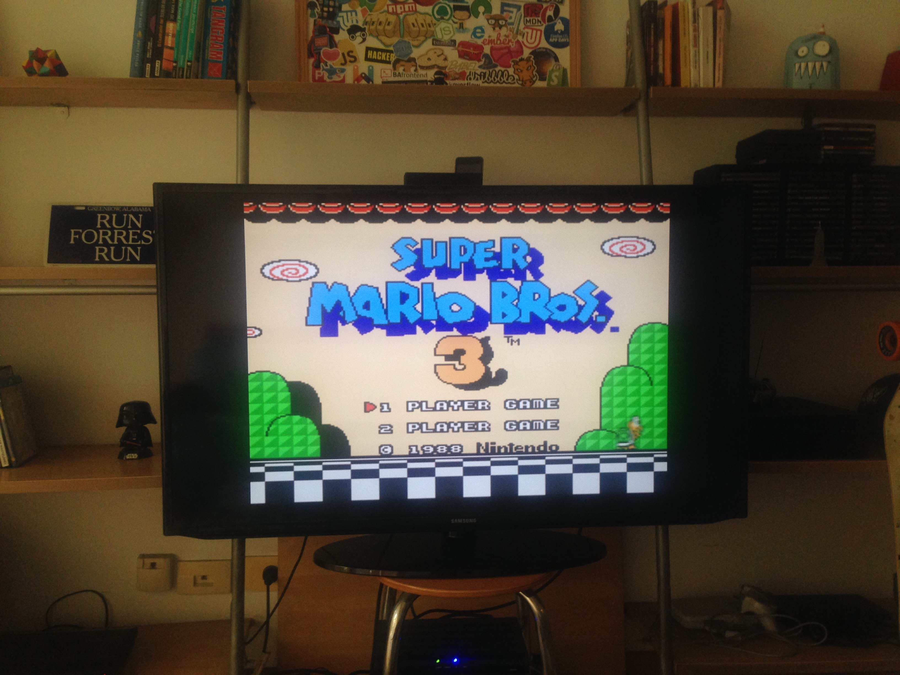

It took me many [attempts to setup to make the most of it](https://lean8086.com/articles/a-complete-guide-to-setting-up-retropie/), but everything was worth it in the end.

## Must-haves

I started looking everywhere for an old arcade cabinet to make a restoration and adaptation, but I only found extremely expensive wooden cabinets in very bad conditions.

Most of them were:

- Expensive.
- Not worthwhile for restore.
- Hard to move.
- Too big for an apartment.

By making that research I realized that the only way to get the results I wanted would be by building my own arcade cabinet from scratch.

In that terms, I was looking for something that was:

- Relatively easy to build.
- Affordable.
- Sized for an apartment.
- Old-school/nostalgic.
- Able to use some old hardware that I already had.

## The plans

Right after set my goals of what would be my ideal arcade machine, I found the [Project MAME](http://koenigs.dk/mame/eng/index.htm).

It provides open source plans to build an arcade cabinet from scratch, detailed [step-by-step](http://koenigs.dk/mame/eng/stepprojectmame.htm).

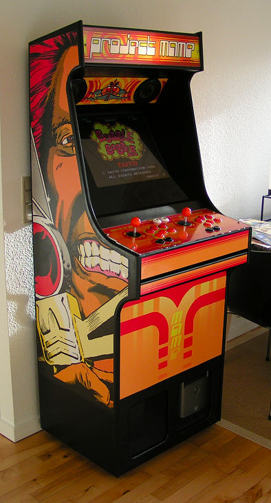

Although It was made to handle an X-arcade controller, it also was a good adaptation from old-school cabinets that was made to perfectly fit a flat screen inside.

One of the builds that emerged from Project MAME and caught my attention was this [Paper Mario themed arcade](http://zonaarcade.forumcommunity.net/?t=48865036).

This spanish maker not only [improved the original plans](http://img543.imageshack.us/img543/5624/repordiviciacosplanos.gif), but he also made available the [side art](https://zonaarcade.forumcommunity.net/?t=45015457) and a [SketchUp model](https://www.sketchup.com/).

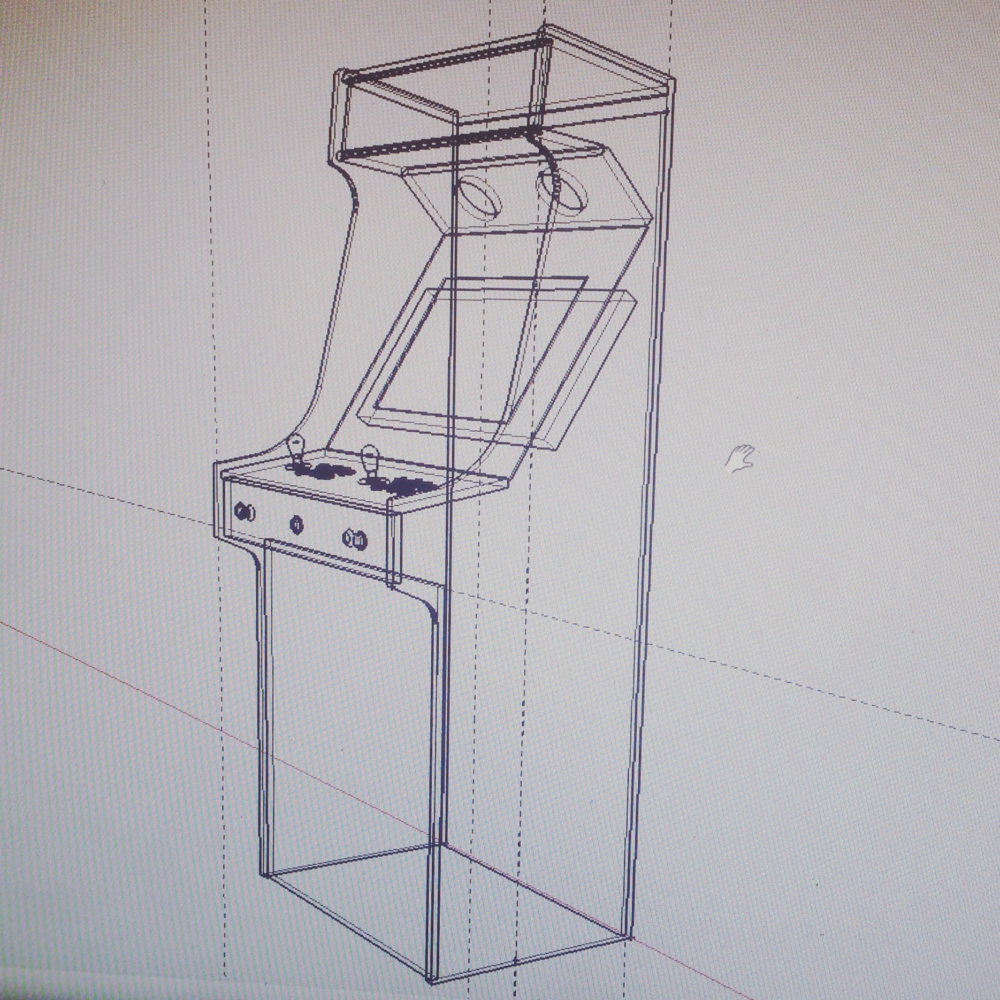

I only had to extend the width of the original plans by 2cm so the cabinet could fit a Samsung 26" LCD screen that I've already had. The rest was followed as specified.

## A model in cardboard

The first approach to test the dimensions and distribution of the elements was making a 1:10 model in cardboard as Project MAME suggests in the [step-by-step guide](http://koenigs.dk/mame/eng/stepprojectmame.htm).

That way I was sure that all made sense and I was able to check if something needed to be adjusted or redefined. Especially after the width modification that I had to do to fit my monitor.

The model is 17cm height and it was very helpful on defining the size and distribution of the speakers too.

## Materials

Before to spend some money on materials, there was a very important decision to make about what kind of wood I would use: **MDF/HDF, plywood or particleboard**.

I wrongly chose MDF/HDF. If I would know at that time how hard is to clean up the extremely thin powder after sanding, I would chose other one. But in the other hand it was a very versatile wood: easy to cut, drill and give shape.

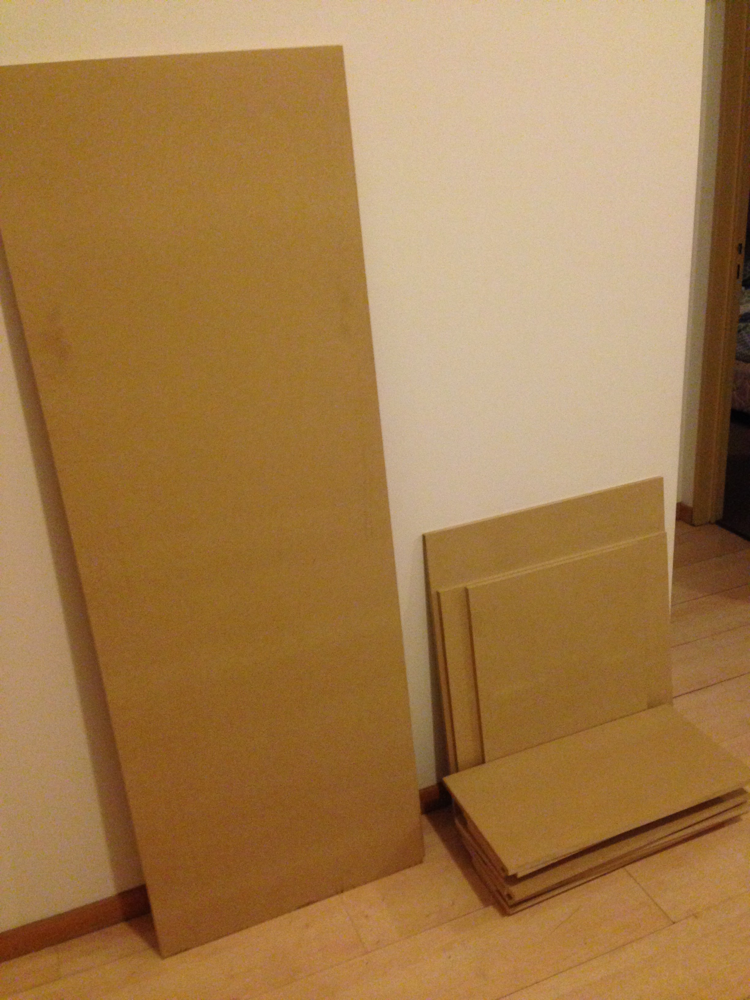

I made a list with all the materials I used trough the entire project.

### Wood (15mm MDF boards):

- (2) 176cm x 60cm: Both sides
- cm x 62cm: Front panel
- cm x 62cm: Back panel
- cm x 62cm x 5mm thin: Back door
- 22cm x 62cm: Controllers top panel
- 15cm x 62cm: Controllers front panel
- cm x 62cm: Speakers panel
- cm x 62cm: Marquee top panel
- cm x 62cm: Marquee bottom panel
- cm x 62cm: Monitor support
- And [4cm x 2cm pine battens](#battens)

### Acrylic (crystal clear):

- *cm x 62cm*: Monitor cover
- *25cm x 62cm*: Controllers art cover
- *(2) 13cm x 62cm*: Marquee back and front

### Others:

- [Caladora de mano Black+Decker](#cuts)
- [3cm mechas](./.jpg)
- [10 lijas de X (gruesa) y de Y (fina)](#lijing)
- [tornillos para madera, tornillos para battengs](./.jpg)
- [Sanwa? controllers 12 buttons + 2 white buttons](#controllers)
- [Crystal-clear acrylic boards](#acrylics)
- [Speaker grills](#acrylics)
- [Wheels](#acrylics)
- [4xmatte black + 2x white spray paint + base paint](#painting)
- led light

## First cuts

After get all the MDF boards, I started drawing on the big boards the lateral shape based on the plans. I also used a compass to draw the curves.

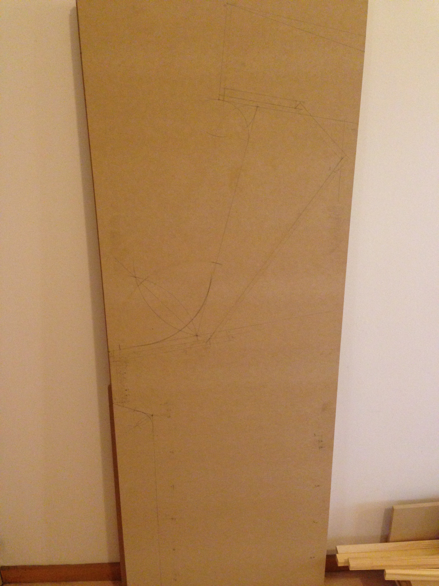

I sticked both boards together with tape to make only one cut. Using a jig saw, I started from bottom to top. I always recommend to move forward very slowly to stick to the line as much as possible.

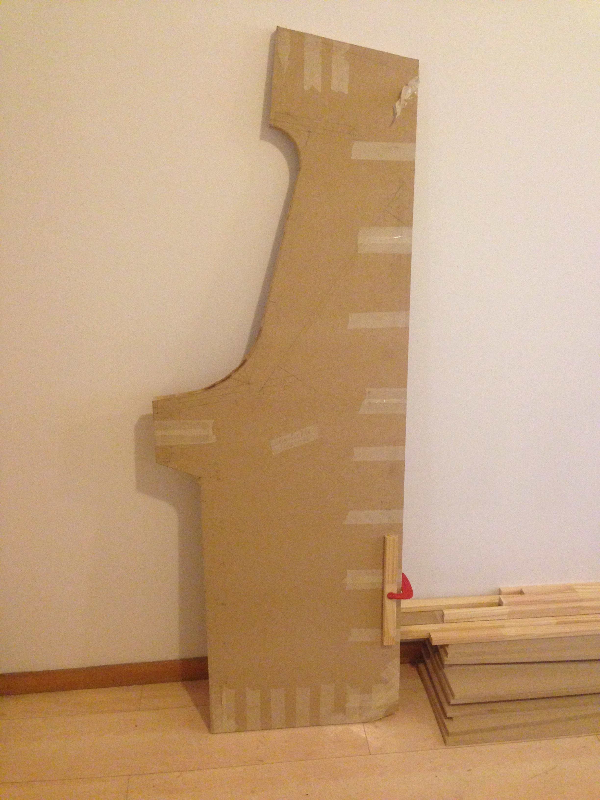

By making my first cut, I learnt some things:

- **MDF/HDF detaches an extremely thin powder:** It doesn't matter how much protection you can wear (gloves, mask, safety glasses), I had to deal with powder in my mouth, hair and clothes for days. It was nearly impossible to clean up after cut or sand. Even I broke a vacuum cleaner.
- **A hot blade will burn the wood:** Don't try to make a cut in a single run. It's better to let the jig saw rest from time to time.

- **While making the cut, the blade tends to curve:** In my case it would have been better to cut both lateral boards separately, because the wider is what you're cutting the more the blade curves. That way both boards were uneven and I had to correct by sanding.

## Sandpaper

I used XXXXX white (why white):

After sanding all the bordes I got a good shape. Tambien aproveche para emparejar errores del corte.

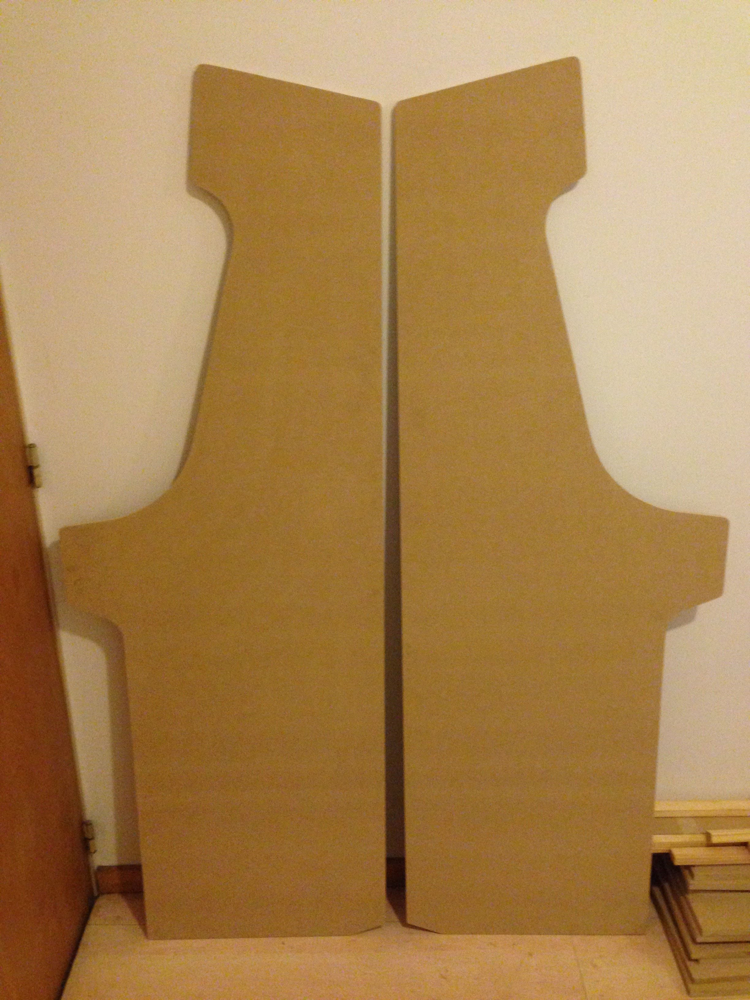

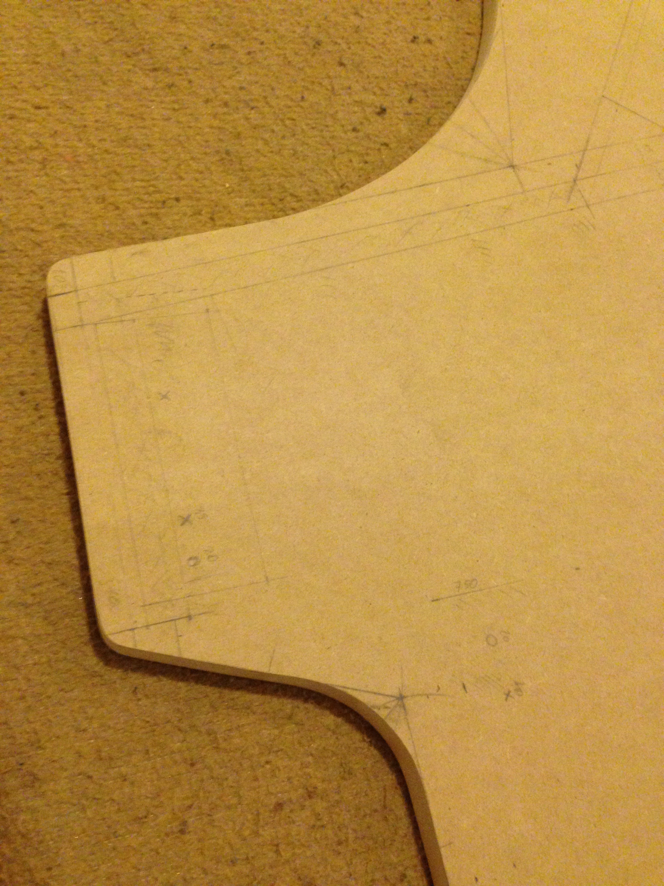

## Battens

I decided to join all the pieces with battens, glued and fixed with screws. **That way I had millimetric precision and I didn't needed help from anyone.**

I bought a lot of 40mm x 20mm pine battens and I cut them in pieces the size of boards they join.

It's not necessary to use glue when you're already using screws, but I decided to use it anyway to hold tight the entire structure. I've also stretched the holes to give a better finish.

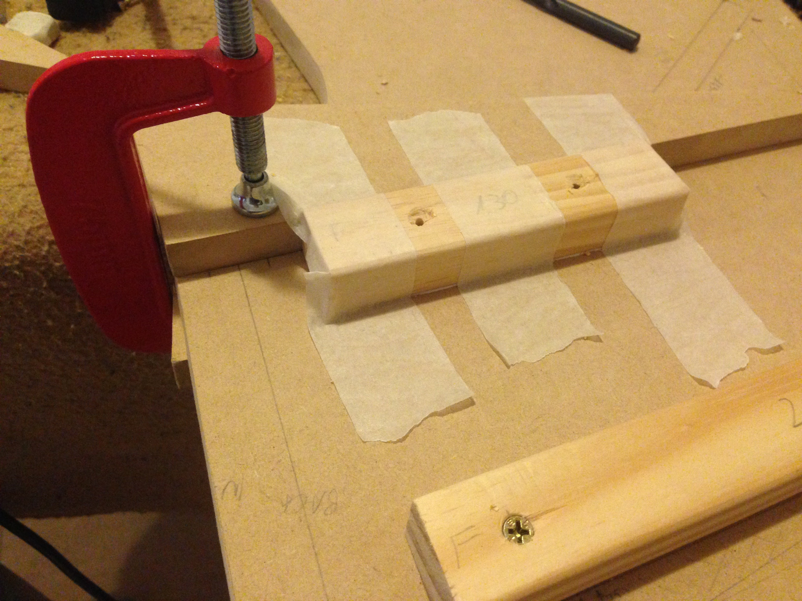

I attached all the battens to both lateral boards.

## First assembly

I put all the pieces together to see the final shape and size. My first impression was to see a huge fridge inside my apartment, but it got better when finished.

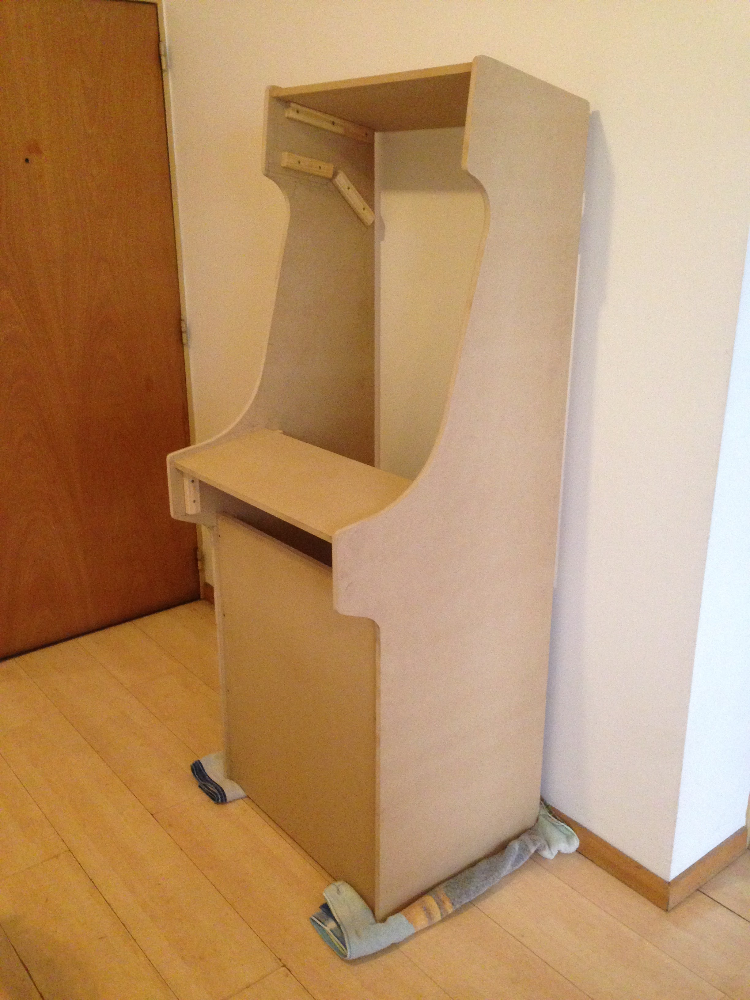

I also installed the bottom cover and attached two wheels to handle the entire structure. I made a diagonal cut in both laterals to let the wheels stand out when the cabinet is inclined.

## Monitor

I decided to use some old hardware that I already had at home.

I had a good old LCD monitor (Samsung T260n, 26") that was perfect for this cabinet. I think an ideal size would be about 23", but I wouldn't spend money in a new monitor when I had that one at home.

There was one constraint: this monitor was originally made to be beautiful from behind, so it has no holes in the back to fix to a support with screws.

I found an unofficial wall mount for this monitor. It works as a replacement of the original support.

I installed the mount over a "T" board that I improvised to support all the weight it could handle.

To make all the calculations to place the monitor aligned, I made a fake paper monitor and installed in place.

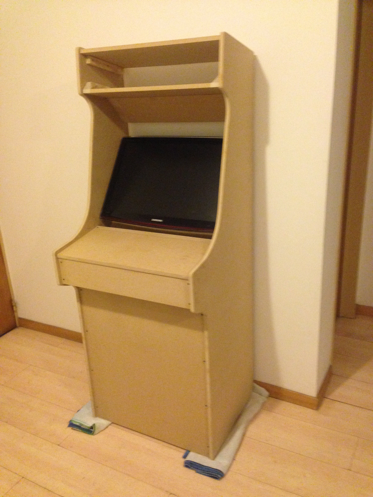

Using some battens leftovers, I cutted two supports for the monitor and two triangles to hold the [acrylic cover](#).

## Controllers

It's plenty of controllers available for DIY projects out there. I bought a MAME kit which includes:

- 2 High quality Sanwa-like joysticks.
- 16 HAPP push buttons: 7 in red, 7 in blue and [2 in white to play pinball](#).
- 1P/2P buttons.
- USB board with cables for each button and joystick.

I made a little research about button distributions for arcade cabinets and I found this [complete article](#) about the most common distributions.

The author of the article has also made his own distribution based on an average of the measures of every controller. I used that to test location and separation on a cardboard box.

I drew the controllers for both players on the MDF board to drill.

Then I installed the MAME kit including both joysticks, 14 push buttons, 1P/2P buttons and the USB board.

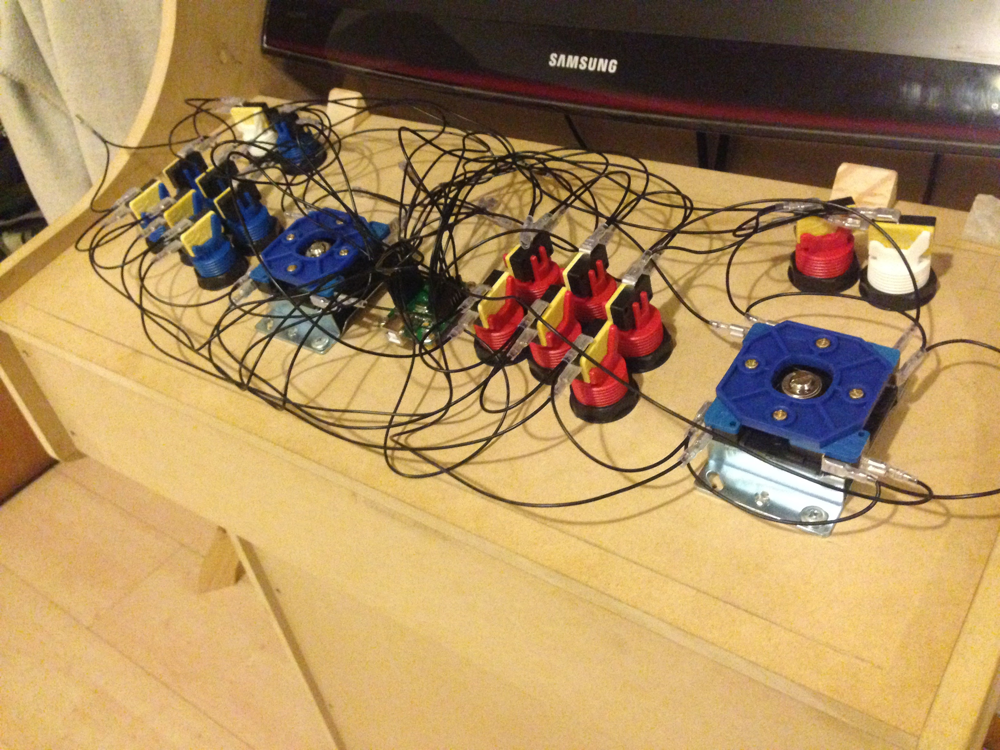

## Speakers

The cardboard model was very useful to make a first check on speakers size and distribution. Then I used some paper stencils to make adjustments in the actual cabinet to find the perfect spot for speakers grills.

Speaker grills are bigger than the speakers itself, and stencils represents the grills instead of the holes.

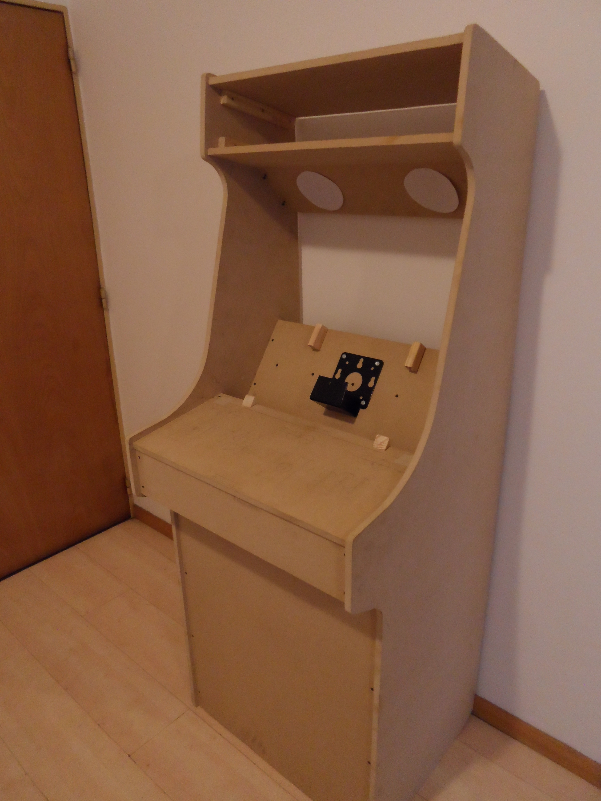

Besides I had only one subwoofer, I decided to use two bottom grills to hold a 140mm cooler fan too.

## Acrylics

I bought some crystal-clear acrylic boards to cover the monitor, controllers and marquee.

### Monitor cover

After sanding some edges of the bigger acrylic board (620 x 700mm), I attached it to the [triangle battens](#) in front, and put some screws in the back of speakers board.

### Marquee

For the marquee I used 2 acrylic boards (130 x 620mm) to hold a transparent print in between. I attached both acrylics with 4 screwed stainless steel clamps.

### Controllers cover

Due to I had to drill 18 holes in the acrylic I decided to got 2 acrylic boards to make some fails.

It was the perfect choice because the first experience drilling acrylic was awful. It melted down over the heat of the drill bit and gave an uneven result.

Then I realized you can use water to keep cold the drill bit and the acrilic board. It took nearly 10 minutes to make every hole, but the results were outstanding.

## Paint job

My kit for painting included 1 litre of white base paint, some matte black and white spray cans, a couple of rollers and a mask.

### Putty

I covered all the screws with putty and sanded till I got a smooth surface.

### Base paint

I applied white base paint for wood to the entire cabinet, to seals the pores of the wood and set a base color to apply another painting later.

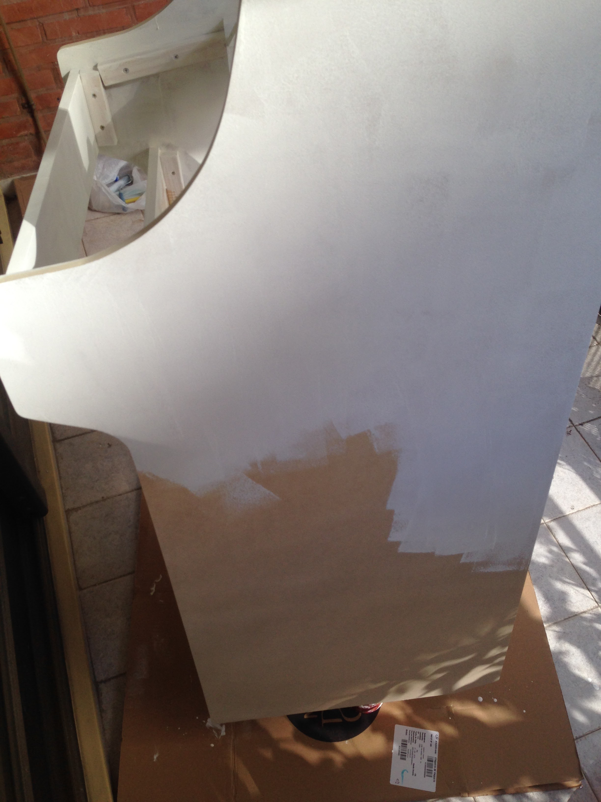

### Black and white

I masked all except both laterals and one face of the controllers board. Then applied white paint in spray where all the vinyl prints are gonna be in to highlight the printed colors.

## Vinyls

The maker of Paper Mario arcade cabinet made available the [side art](https://zonaarcade.forumcommunity.net/?t=45015457), and after printing it, I installed in all the sides painted in white.

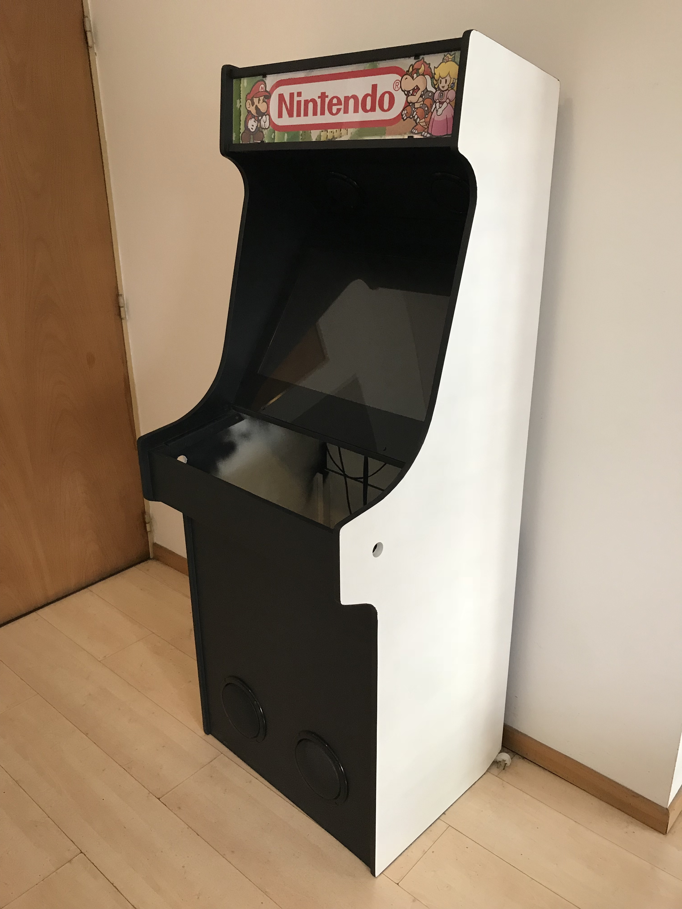

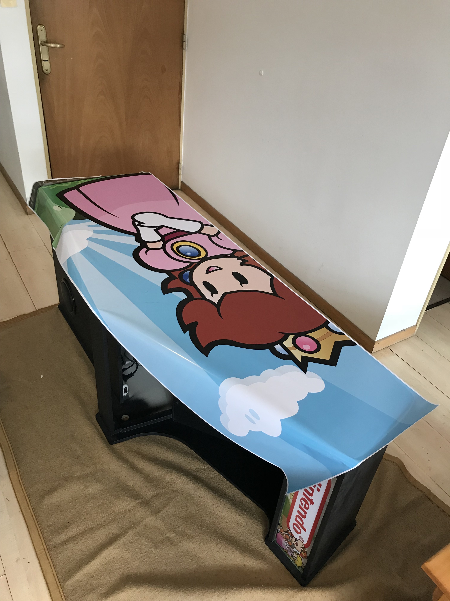

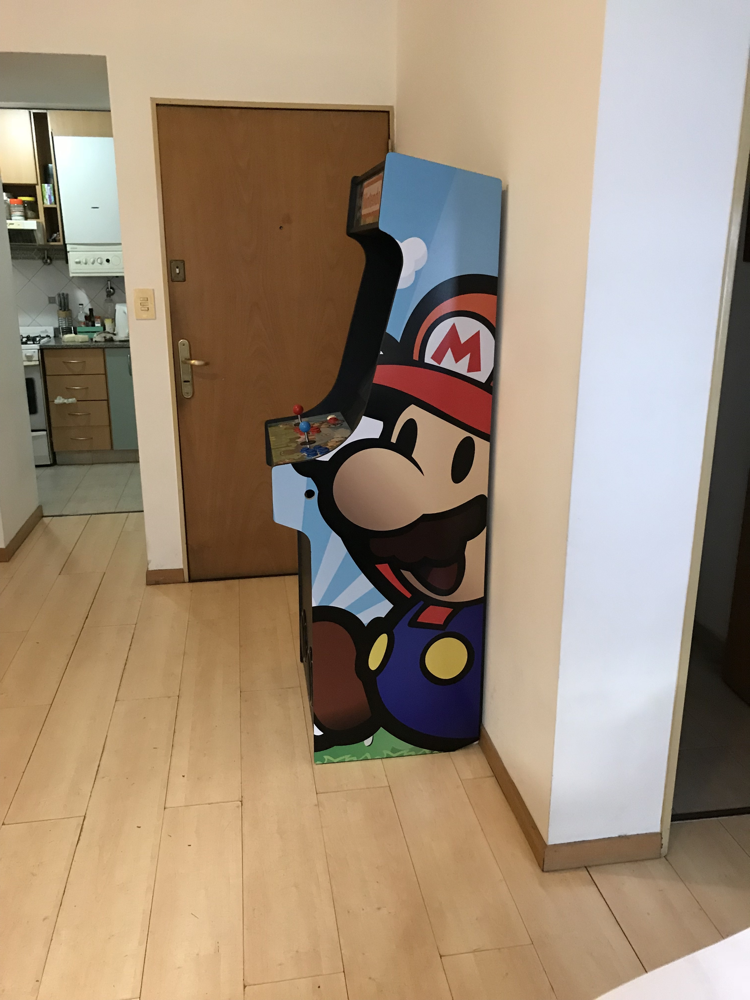

## Final form

The last piece in this 2-years long puzzle, were the black buttons to play pinball games. Those HAPP buttons are connected as an extension of the left arrow of the 1P joystick and one of the buttons of the same player. That is because every retro pinball game I installed uses that controllers as a standard.

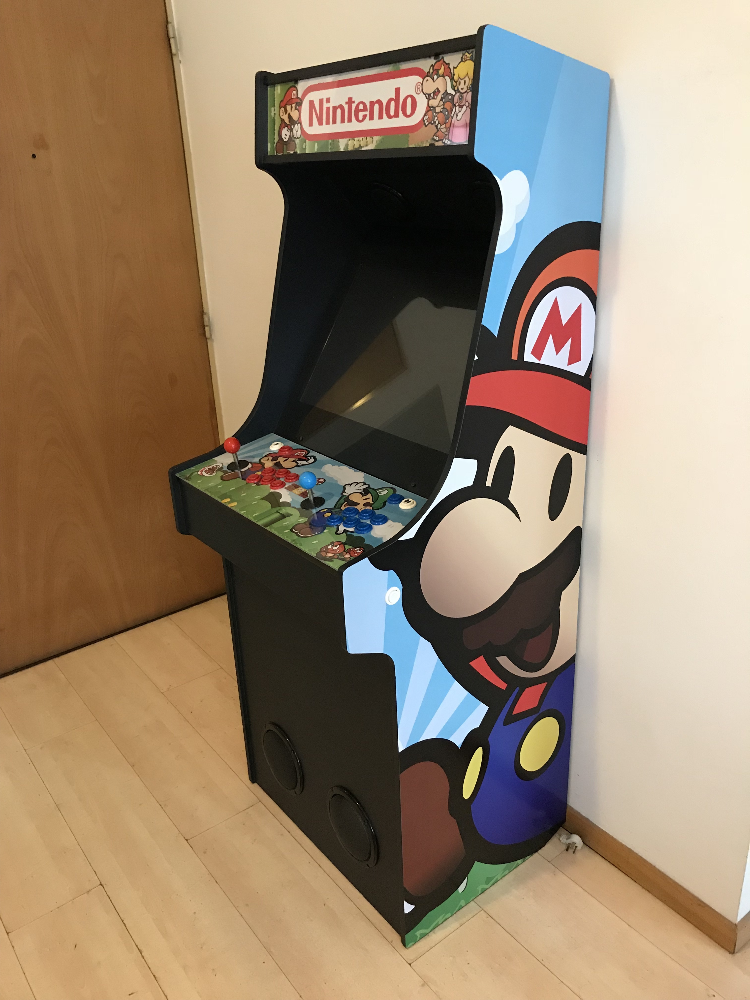
