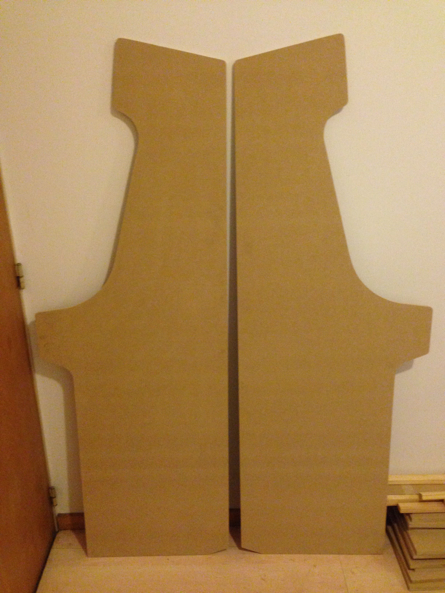
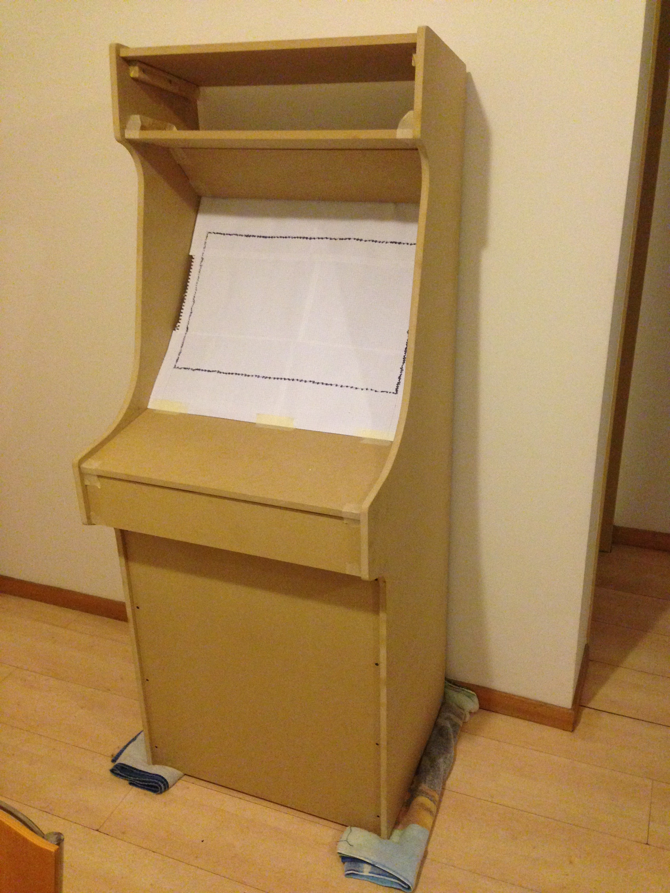
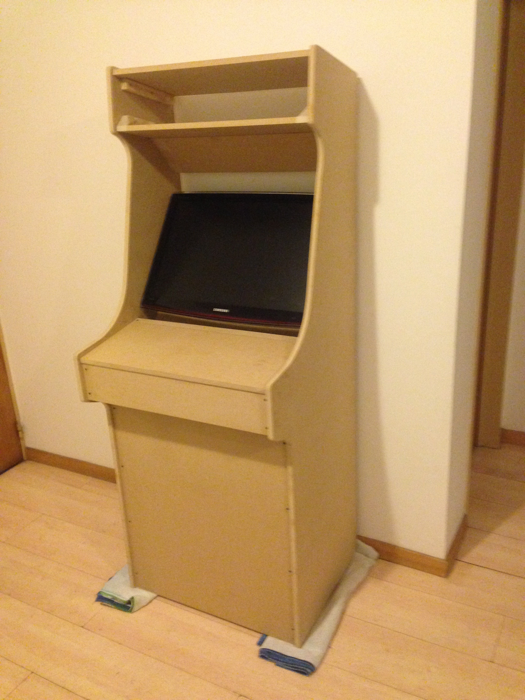
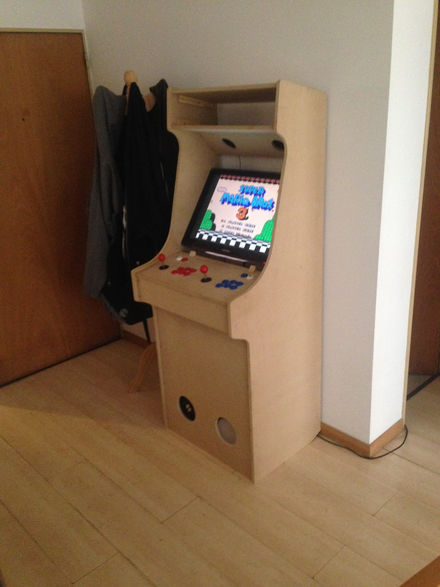
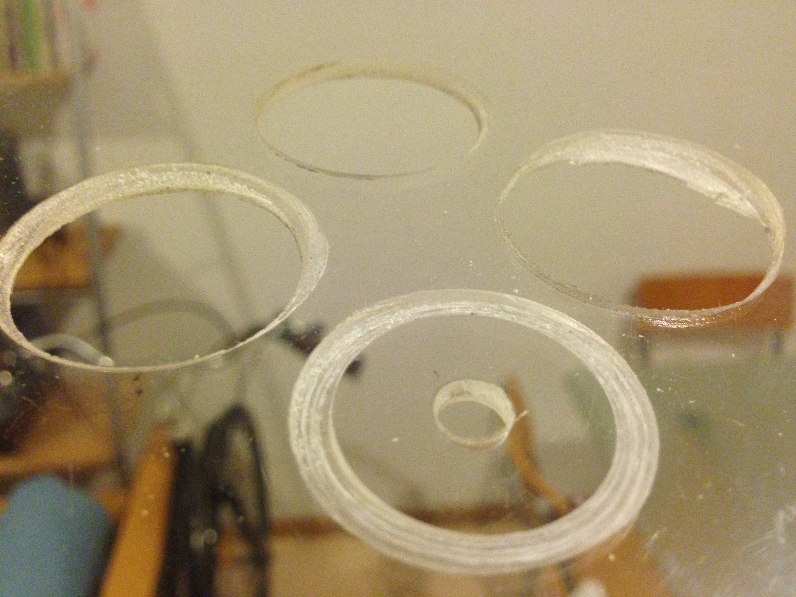
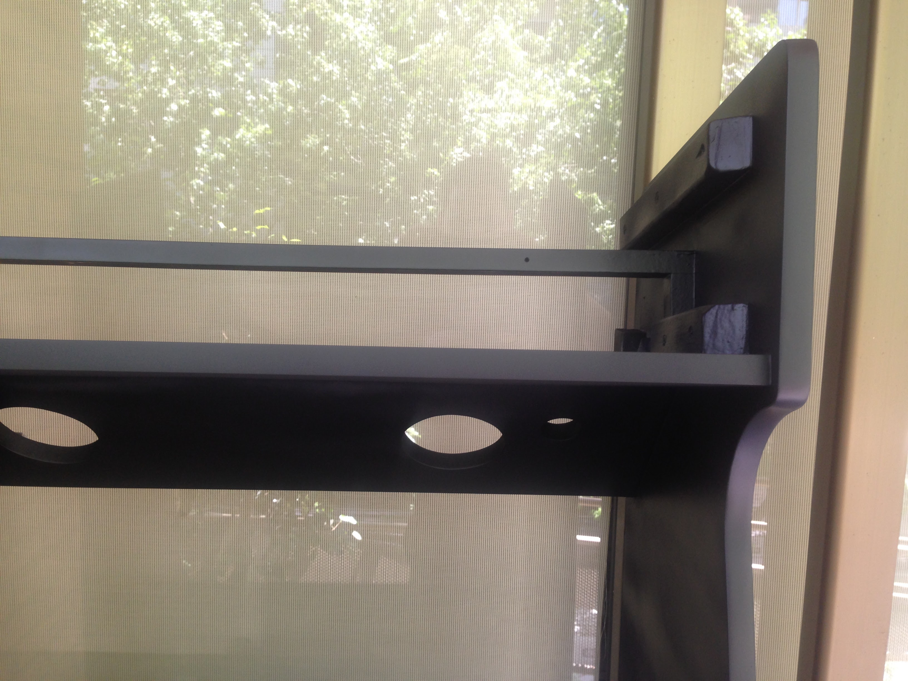
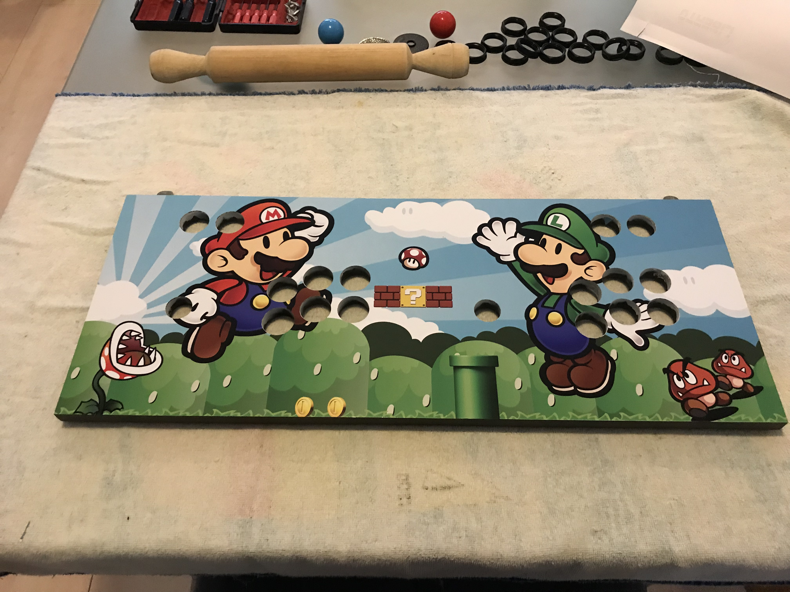

When I was a child I was in constant interaction with tools since my parents built our life-long house and a huge amount of things inside it.

I've grown building all kind of small things and planning a ton of ideas to make someday. But I've always wanted to have one huge project. A project big enough to defy the idea of me being really able to call myself a maker.

As time went by, I gradually move that deep desire for create things to the virtual world of programming, always keeping a close eye on projects related to IOT. This new wave of making combines the best of both worlds: you build things and write some sort of code that gives life to that stuff. How cool is that.

Some time ago in 2013, I luckily won a starter kit from [Make Magazine](https://makezine.com/) with a Raspberry Pi Model 1.

There was the first time I had access to this kind of computing power to build something new. Since then, I started looking for interesting things to make but it was difficult to find different things from thermometers and robot arms.

## RetroPie

I've almost gave up when I found [RetroPie](https://retropie.org.uk/).

This project allows you to turn your Raspberry Pi into a retro-gaming machine. So I made a quick test with some ROMs to check how it worked. It was really easy to have a working retro console with nearly zero configuration.

It took me [many attempts to setup RetroPie](https://lean8086.com/articles/a-complete-guide-to-setting-up-retropie/) to make the most of it, but everything was worth in the end.

## Goals

When everything was working I realize I could fit everything inside a retro arcade cabinet.

I started looking everywhere for cabinets to restore and adapt, but I only found extremely expensive wooden boxes in very bad conditions.

Most of them were:

- Not worthwhile for restore.
- Hard to move.
- Too big for an apartment.
- Expensive.

By making that research I realized the only way to get the results I wanted would be by building my own arcade cabinet from scratch.

In that terms, I was looking for something that was:

- Relatively easy to build.
- Affordable.
- Sized for an apartment.
- Old-school/nostalgic.

## The plans

Right after set my goals of what would be my ideal arcade machine, I found the [Project MAME](http://koenigs.dk/mame/eng/index.htm).

It provides open source plans to build an arcade cabinet from scratch, detailed [step-by-step](http://koenigs.dk/mame/eng/stepprojectmame.htm).

Although it was made to handle an X-arcade controller, it also was a good adaptation from old-school cabinets. And it was made to perfectly fit a flat screen inside.

One of the builds that emerged from Project MAME and caught my attention was this [Paper Mario themed arcade](http://zonaarcade.forumcommunity.net/?t=48865036).

This spanish maker [improved the original plans](http://img543.imageshack.us/img543/5624/repordiviciacosplanos.gif) and made available the [side art](https://zonaarcade.forumcommunity.net/?t=45015457) and a SketchUp model as well.

I only had to modify the width of the original plans by 2cm so the cabinet could fit an old monitor that I've already had. The rest was followed as specified.

## A model in cardboard

The first approach to test the dimensions and distribution of the elements was making a 1:10 model in cardboard as Project MAME suggests in the [step-by-step guide](http://koenigs.dk/mame/eng/stepprojectmame.htm).

That way I was sure that all made sense and I was able to check if something needed to be adjusted or redefined. Especially after the width modification that I had to do to fit my monitor.

The model was 17cm height and it was very helpful on defining the size and distribution of the speakers too.

## Materials

Before to spend some money on materials, there was a very important decision to make about what kind of wood I would use: **MDF/HDF, plywood or particleboard**.

I wrongly chose MDF/HDF. If I would know at that time how hard is to clean up the extremely thin powder after sanding, I would chose another material. But in the other hand, it was a very versatile wood: easy to cut, drill and give shape.

I made a list with all the materials I used trough the entire project.

### MDF boards (15mm thin):

- **(2) 176cm x 60cm:** Both laterals
- **cm x 62cm:** Marquee top panel
- **cm x 62cm:** Marquee bottom panel
- **cm x 62cm:** Speakers panel
- **cm x 62cm:** Monitor support
- **22cm x 62cm:** Controllers top panel
- **15cm x 62cm:** Controllers front panel
- **72cm x 62cm:** Front panel
- **cm x 62cm:** Back panel

### Crystal-clear acrylic boards (3mm thin):

- **cm x 62cm:** Monitor cover
- **22cm x 62cm:** Controllers art cover
- **(2) 13cm x 62cm:** Marquee back and front

### Tools and others:

- [Black & Decker jigsaw](#first-cuts)
- [180- and 360-grit sandpaper](#sandpaper)
- 4cm x 2cm [pine strips](#strips)
- 6 x 1¼ golden screws for the strips
- 6 x 1½ black screws for the MDF boards

## First cuts

After bringing home all the MDF boards, I started drawing the lateral shape on the big boards based on the plans. I also used a pair of compasses to draw the curves.

I put both boards together with tape to make only one cut. Using a jigsaw, I made the cut from bottom to top. I always recommend to move forward very slowly to stick to the line as much as possible.

By making the first cut, I learnt many things:

- **MDF/HDF detaches an extremely thin powder:** It doesn't matter how much protection I could wear (gloves, mask, safety glasses), I had to deal with powder in my mouth, hair and clothes for days. It was nearly impossible to clean up after cut or sand. I even broke a vacuum cleaner trying to clean.
- **A hot blade will burn the wood:** Don't try to make a cut in one single run. It's better to let the jigsaw to cool from time to time.
  
- **While making the cut on a wide wood, the blade tends to curve:** In my case it would have been better to cut both lateral boards separately, because the wider is what you're cutting the more the blade curves. That way both boards were uneven and I had to fix by sanding.

## Sandpaper

I used 180- and 360-grit sandpaper. The first one is a coarse grit for smoothing surfaces and removing imperfections. The second one is a fine grit for finishing surfaces smoothly.

After sanding all the edges I achieved outstanding results giving a rounded shape to the corners and fixing some mistakes I made during the cut.

I also used the 360-grit sandpaper to smooth the surfaces between each paint coat.

## Strips

I decided to join all the pieces with strips, glued and fixed with screws. That way I had millimetric precision to position everything.

I bought a lot of 4cm x 2cm pine strips and I cut them in pieces the size of boards they join.

It's not necessary to use glue when you're already using screws, but I decided to use it anyway to hold tight the entire structure. I've also made some space for the head of the screws to give the strips a better finish.

I attached all the strips to both lateral boards.

## First assembly

I put all the pieces together to see the final shape and size. My first impression was to see a huge fridge inside my apartment, but it got better when finished.

I've also installed the bottom cover and attached two wheels to handle the cabinet around. I made a diagonal cut in both laterals to let the wheels lean on the floor when the cabinet is inclined.

## Monitor

I decided to use some old hardware that I already had at home.

I had a good old LCD monitor Samsung T260n (26" screen) that was perfect for this cabinet. I think an ideal size would be about 23", but I wouldn't spend money in a new monitor when I had that one at home.

There was one constraint: this monitor was originally made to be beautiful from behind, so it has no holes in the back to attach to a wall mount. Luckily, I found an unofficial mount.

I installed the mount over a "T" board that I improvised to support all the weight it could handle.

To make all the calculations to place the monitor in an aligned way, I made a fake paper monitor and installed in place.

Using some strips leftovers, I cut two supports for the monitor and two triangles to hold the [acrylic cover](#acrylics).

## Controllers

It's plenty of controllers available for DIY projects out there. I bought a MAME kit which includes:

- 2 High quality Sanwa-like joysticks.
- 16 HAPP push buttons: 7 in red, 7 in blue and [2 in white to play pinball](#final-form).
- 1P/2P buttons.
- USB board with cables for each button and both joysticks.

I made a little research about button distributions for arcade cabinets and I found this [absolute priceless article](https://www.slagcoin.com/joystick/layout.html) about the most common panel layouts.

The author of the article has also made his own distributions based on an average of the measures of every controller. I used a mix between some Sega layouts and tested on a cardboard box.

I drew the layout for both players on the MDF board and drilled.

Then I installed the MAME kit including both joysticks, 14 push buttons, 1P/2P buttons and the USB board.

## Speakers

I had a really great Genius 2.1 speaker system with subwoofer that I bought when I had my first job back in 2007. ****So it seemed really I wanted to include that special speakers to this special project.

The cardboard model was very useful to make a first check on speakers size and distribution. Then I used some paper stencils to make adjustments in the actual cabinet to find the perfect spot for speakers grills.

Speaker grills are bigger than the speakers itself, and stencils represents the grills instead of the holes.

Besides I had only one subwoofer, I decided to use two bottom grills to hold a 140mm cooler fan in one of the holes.

## Acrylics

I bought some crystal-clear acrylic boards to cover the monitor, controllers and marquee.

### Monitor cover

After sanding some edges of the bigger acrylic board (620 x 700mm), I attached it to the [triangle strips](#) in front, and put some screws in the back of speakers board.

### Marquee

For the marquee I used 2 acrylic boards (130 x 620mm) to hold a transparent print in between. I attached both acrylics with 4 screwed stainless steel clamps.

### Controllers cover

Due to I had to drill 18 holes in the acrylic I decided to got 2 acrylic boards to make some fails.

It was the perfect choice because the first experience drilling acrylic was awful. It melted down over the heat of the drill bit and gave an uneven result.

Then I realized you can use water to keep cold the drill bit and the acrylic board. It took nearly 10 minutes to make each hole, but the results were outstanding.

## Paint job

My kit for painting included 1 liter of white base for wood, some matte black and white spray cans, a couple of rollers and a mask.

### Putty

I covered all the screws with putty and sanded till I got a smooth surface.

### Base paint

I applied white base paint for wood to the entire cabinet, to seals the pores of the wood and set a base color to apply another painting later.

### Black and white

I masked all except both laterals and one face of the controllers board. Then applied white paint in spray where all the vinyl prints are gonna be in to highlight the printed colors.

## Vinyls

The maker of Paper Mario arcade cabinet made available the [side art](https://zonaarcade.forumcommunity.net/?t=45015457), and after printing it, I installed in all the sides painted in white.

## Final form

The last piece in this 2 years long puzzle, were the white buttons in both sides to play pinball games. Those HAPP buttons are connected as an extension of the left arrow of the 1P joystick and one of the buttons of the same player. That's because every retro pinball game I installed uses that controllers as a standard.

